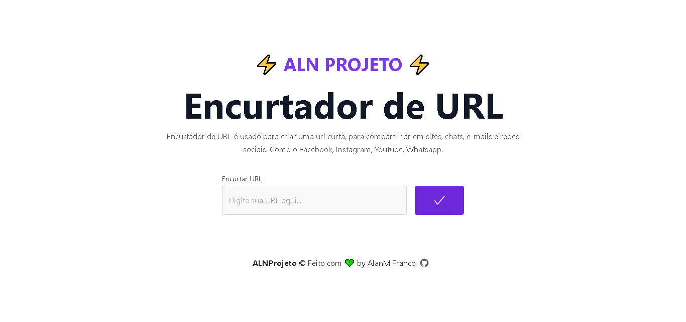

<a href="https://aln-url-shortener.vercel.app/">
<h1 align="center" style="font-weight: bold;">⚡ ALN Projeto ⚡ - URL Shortener</h1>
</a>

  Encurtador de URL é usado para criar uma url curta, para compartilhar em sites, chats, e-mails e redes sociais. Como o Facebook, Instagram, Youtube, Whatsapp. 

  

Este projeto foi desenvolvido para por em praticar o uso das arquiteturas e a utilização do Prisma 2.

 

 

## 🚀 Tecnologias
Esse projeto foi desenvolvido com as seguintes tecnologias:

* [React](https://reactjs.org/) - A JavaScript library for building user interfaces
* [Next.js](https://nextjs.org/) - The React Framework
for Production
* [Typescript](https://www.typescriptlang.org/) - Typed JavaScript at Any Scale.
* [Node.js](https://nodejs.org/en/) - A JavaScript runtime built on Chrome's V8 JavaScript engine.
* [Express.js](http://expressjs.com/) - Fast, unopinionated, minimalist web framework for Node.js
* [Prisma](https://prisma.io/) - Next-generation Node.js and TypeScript ORM
* [PostgreSQL](https://www.postgresql.org/) - The World's Most Advanced Open Source Relational Database

## 🎉 Funcionalidades
* Funcionalidade de criar um encurtador de URL ✅
* Redirecionamento da URL encurtada pelo NextJS utilizando Server Side Rendering ✅
* Implementado no back-end (NodeJS + TypeScript) a arquiterua: Domain Driven Design (DDD), Clean Code e SOLID ✅

---

Feito com 💚 by AlanM Franco  [Visite meu Portfolio!](https://alnmaurofranco.github.io/)